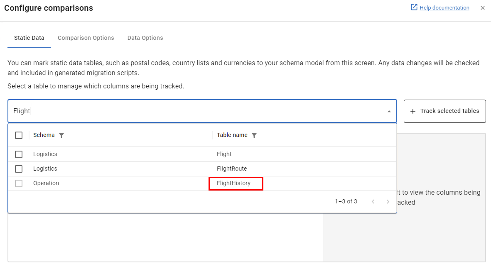

# Tracking a Configuration / Static / Reference Table with Flyway Desktop

This guide explains how to use Flyway Desktop to track a table and its data that you have already created by running `StaticData_1.sql` manually.

## 1. Run the Script Manually

1. Open your preferred SQL client.
2. Connect to your target database.
3. Execute the contents of `StaticData_1.sql` to create the table and insert the initial data.

## 2. Track the Table in Flyway Desktop

1. Open Flyway Desktop and connect to your project.
2. Go to the **Schema Model** section of the GUI.
3. Under **Static Data & Comparisons** found in the GUI, head into the **Static Data** section and search for the table we just created.

4. Click **+ Track Selected Tables**
5. You can click on the Table Name, and customise which Columns you would like Flyway to be responsible for, but when ready hit **save**.
6. Make sure you save both the Schema and Data Changes to the schema model before progressing!

## Generate Migration Script for new Table and Data

**IF** The table is new, and does not exist in our downstream environments we need to now geneate a deployment script for this object!

1. If the table has been saved into our schema model, it should be as easy as clicking **Generate Migrations**, and then selecting the new table.
2. Validate that this script does work, before pushing up the CI/CD or Deploying through the GUI.

---

**Tip:**  

IF a baseline script has been generated already, but the data we capture **DOES** exist downstreaamm its important that we do not generate these changes into a 
versioned migration script, as we do not want to try to reinsert the data that already exists. 
In this scenario, we need to add this into our baseline script, rather than generate a new migration. 
See [insert new quest for updating our baseline script]